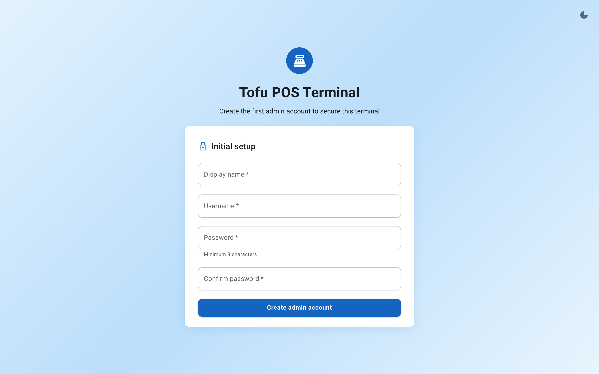
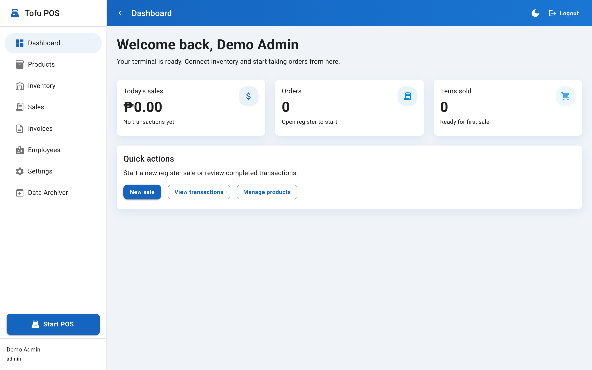
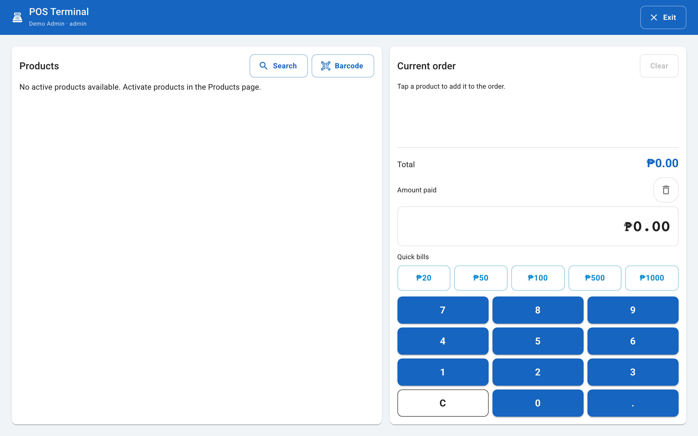
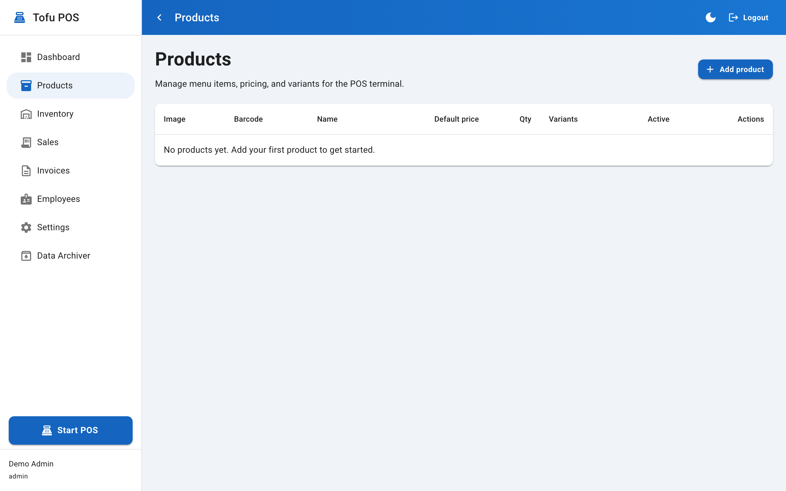
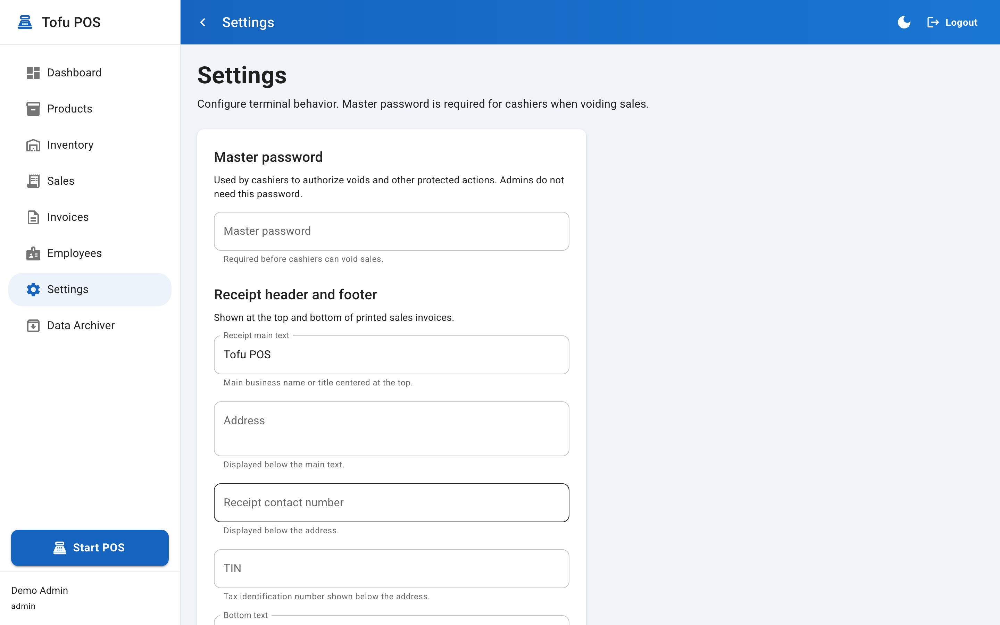

# Tofu POS Terminal

[](https://github.com/huhu2323/pos_inv/actions/workflows/ci.yml)
[](https://nodejs.org/)
[](https://react.dev/)
[](https://www.typescriptlang.org/)
[](https://vite.dev/)
[](https://www.electronjs.org/)
[](https://capacitorjs.com/)
[](#license)

An offline-first point-of-sale terminal for a single register. All sales, inventory, invoices, and settings are stored locally on the device — no backend server required.

Runs as a **web app**, **desktop app** (Windows / macOS via Electron), or **Android tablet app** (via Capacitor).

---

## Screenshots

### Initial setup

On first launch, create the admin account that secures the terminal. There are no default credentials.



### Dashboard

Daily sales summary, quick actions, and navigation to every module.



### POS terminal

Full-screen register with product grid, cart, numpad, quick bills, search, and barcode entry.



### Products

Admin catalog management with barcodes, variants, images, stock quantities, and active/inactive toggle.



### Settings

Receipt header/footer, VAT, master password, auto-invoice, and barcode scanning options.



---

## Features

### Point of sale
- Touch-friendly full-screen register
- Product grid (base products and per-variant tiles)
- Cart with quantity controls, line removal, and clear
- On-screen numpad with Philippine peso quick bills (₱20, ₱50, ₱100, ₱500, ₱1000)
- Product search with on-screen QWERTY keyboard
- Barcode entry (manual or USB/Bluetooth scanner as keyboard input)
- Continuous barcode scanning mode (optional, in Settings)
- Real-time change calculation
- Stock validation and automatic quantity deduction on sale

### Sales & invoicing
- Complete transaction history with line-item detail
- Sequential 6-digit invoice numbers (`000001`, `000002`, …)
- 80 mm thermal-style PDF receipts via jsPDF
- Optional auto-invoice + print after each completed sale
- Void sales with stock restoration (cashiers require master password)
- VAT breakdown on every invoice

### Inventory & products
- Product catalog with barcode, short name, description, and images
- Product variants (name, price, image, quantity each)
- Active/inactive toggle — only active products appear in POS
- Inbound/outbound inventory logs with before/after quantities

### Administration
- Employee accounts (`admin` and `cashier` roles)
- App settings (receipt text, VAT, master password, POS behaviour)
- Data archiver — snapshot and clear live sales/invoices to reduce database size

### UX
- Light / dark theme (persisted locally)
- Responsive sidebar (collapsible on desktop, drawer on mobile)
- Large touch targets throughout the POS screen
- PHP currency formatting (`en-PH` locale)

---

## User roles

| Capability | Admin | Cashier |
|------------|:-----:|:-------:|
| Login & POS | ✓ | ✓ |
| Dashboard, Sales, Invoices | ✓ | ✓ |
| Products, Inventory, Employees | ✓ | — |
| Settings, Data Archiver | ✓ | — |
| Void sale without master password | ✓ | — |
| Archive sales/invoices | ✓ (master password) | — |

Cashiers are redirected to the dashboard if they try to open admin-only routes.

---

## Getting started

### Requirements

- **Node.js 20+** (Node 24 recommended; Vite 8 does not run on Node 19)
- npm

```bash
# If you use nvm
nvm use 24
```

### Install & run (web)

```bash
npm install
npm run dev
```

Open [http://localhost:5173](http://localhost:5173).

### First-run setup

1. Launch the app on a fresh device (empty local database).
2. The login page shows **Initial setup** instead of a sign-in form.
3. Enter a display name, username, and password (minimum 8 characters).
4. The first account is created as **admin** and you are signed in automatically.

There are **no built-in default credentials**. Every installation starts from this setup flow.

### Recommended setup after first login

1. Open **Settings** and set a **master password** (required for cashier voids and data archiving).
2. Add products in **Products** (set barcodes, prices, and mark them active).
3. Create **cashier** accounts in **Employees**.
4. Configure receipt header, address, TIN, and VAT percentage in **Settings**.

---

## Pages

| Page | Route | Access | Description |
|------|-------|--------|-------------|
| Login | `#/login` | Public | Sign in or first-run admin setup |
| Dashboard | `#/dashboard` | All users | Today's stats and quick actions |
| POS | `#/pos` | All users | Full-screen register |
| Products | `#/products` | Admin | Product catalog CRUD |
| Inventory | `#/inventory` | Admin | Stock movement log |
| Sales | `#/sales` | All users | Transaction history, void, invoice |
| Invoices | `#/invoices` | All users | Saved invoices and reprint |
| Employees | `#/employees` | Admin | User account management |
| Settings | `#/settings` | Admin | App and receipt configuration |
| Data Archiver | `#/data-archiver` | Admin | Archive / restore sales data |

---

## POS workflow

1. Open **Start POS** from the sidebar (or **New sale** on the dashboard).
2. Add items by tapping the product grid, using **Search**, or scanning/typing a **Barcode**.
3. Adjust quantities with **+** / **−** or remove lines.
4. Enter the amount paid via the numpad or quick-bill buttons.
5. Press **Complete sale** when the amount covers the total.
6. If **Auto-invoice** is enabled in Settings, an invoice is created and the print dialog opens.

### Barcode scanning

The barcode dialog accepts typed input or hardware scanners that emulate a keyboard (most USB and Bluetooth scanners). Press **Enter** to look up the barcode. If the product has variants, a variant picker appears.

Camera-based scanning is not implemented; the scanner icon refers to keyboard-wedge input.

---

## Invoice printing

Receipts are generated client-side as PDF using jsPDF:

- **Width:** 80 mm (thermal receipt format)
- **Header:** Main text, address, contact number, TIN
- **Body:** Date, cashier, invoice number, line items, net amount, VAT, total, amount paid, change
- **Footer:** Configurable bottom text (default: "Thank You")

**Print flow:**
1. PDF opens in a new window with the browser/Electron print dialog.
2. If popups are blocked, the file downloads as `invoice-XXXXXX.pdf`.

Invoices can be printed from **POS** (auto-invoice), **Sales**, or **Invoices**.

---

## Settings reference

| Setting | Default | Description |
|---------|---------|-------------|
| Master password | *(empty)* | Required for cashiers to void sales; required to archive data |
| Receipt main text | `Tofu POS` | Bold centered header on receipts |
| Address | *(empty)* | Multiline address below header |
| Receipt contact number | *(empty)* | Phone or contact line |
| TIN | *(empty)* | Tax ID, printed as `TIN: …` |
| Bottom text | `Thank You` | Receipt footer |
| VAT percentage | `12` | VAT rate applied to invoice subtotals (0–100) |
| Continuous barcode scanning | Off | Keep barcode dialog open between scans |
| Auto-invoice | Off | Create and print an invoice after each POS sale |

---

## Data archiver

Use **Data Archiver** when the sales and invoice tables grow large:

1. Click **Archive** and enter the master password.
2. All current sales and invoices are copied into a snapshot record.
3. Live `sales` and `invoices` tables are cleared.
4. Products, inventory, users, and settings are **not** affected.

**Restore** re-inserts archived records into the live tables. Restore fails if any archived IDs already exist or the archive was previously restored.

---

## Data storage

All data lives on the device. Nothing is sent to a remote server.

| Storage | Used for |
|---------|----------|
| **Dexie / IndexedDB** | Users, sessions, products, sales, invoices, settings, archives, inventory logs |
| **OPFS** (`product-images/`) | Product image files (primary, when supported) |
| **IndexedDB `images` table** | Product image fallback when OPFS is unavailable |
| **sessionStorage** | Current auth token |
| **localStorage** | Theme mode, sidebar collapsed state |

Image uploads are limited to **2 MB** and must be `image/*` files. Stored image keys use the format `img:{uuid}`.

---

## Running on desktop (Electron)

### Development

```bash
npm run electron:dev
```

Starts the Vite dev server and opens the app in an Electron window with hot reload.

### Production build

```bash
npm run electron:build
```

Outputs installers to `release/`:

| Platform | Format |
|----------|--------|
| macOS | `.dmg` |
| Windows | `.exe` (NSIS installer) |

The Electron shell serves the built app over `http://127.0.0.1` so IndexedDB storage remains stable across sessions.

---

## Running on Android (Capacitor)

### Sync web build to Android

```bash
npm run cap:sync
```

### Open in Android Studio

```bash
npm run cap:android
```

Build the APK or AAB from Android Studio (**Build → Build Bundle(s) / APK(s)**).

- **App ID:** `com.tofu.pos`
- **Hardware back button:** navigates back in-app, or exits from the login screen

Requires Android Studio, Android SDK, and a compatible JDK installed locally.

---

## Scripts

| Command | Description |
|---------|-------------|
| `npm run dev` | Vite dev server |
| `npm run build` | Type-check and production build → `dist/` |
| `npm run preview` | Preview production build |
| `npm run lint` | ESLint |
| `npm run build:electron` | Compile Electron main process → `dist-electron/` |
| `npm run electron:dev` | Desktop app (development) |
| `npm run electron:build` | Desktop installers |
| `npm run cap:sync` | Build and sync to Capacitor |
| `npm run cap:android` | Sync and open Android Studio |

---

## Tech stack

| Layer | Technology |
|-------|------------|
| UI | React 19, TypeScript, MUI 9 |
| Routing | React Router 7 (`HashRouter`) |
| Local database | Dexie 4 (IndexedDB) |
| Authentication | bcryptjs, session tokens |
| PDF / printing | jsPDF |
| Images | OPFS + IndexedDB fallback |
| Desktop | Electron 36, electron-builder |
| Mobile | Capacitor 7 (Android) |
| Build | Vite 8 |

---

## Project structure

```
tofu-pos-term/
├── src/
│   ├── auth/           # Login, sessions, roles
│   ├── components/     # Shared UI and POS dialogs
│   ├── db/             # Dexie schema and types
│   ├── hooks/          # React hooks (images, back button)
│   ├── layouts/        # App shell with sidebar
│   ├── pages/          # Route pages
│   ├── services/       # Business logic
│   ├── theme/          # Light/dark theme
│   └── utils/          # Currency, VAT, invoices
├── electron/           # Electron main + preload
├── android/            # Capacitor Android project
├── public/             # Static assets (favicon, default product image)
├── docs/screenshots/   # README screenshots
└── dist/               # Production web build (generated)
```

---

## Security notes

- Passwords are hashed with bcrypt (12 rounds).
- Sessions expire after **8 hours**.
- **5 failed login attempts** lock the username for **15 minutes** (in-memory, per session).
- The master password is stored as a bcrypt hash in local settings.
- All data is local to the device — protect physical access to the terminal.

---

## Regenerating screenshots

Screenshots in `docs/screenshots/` can be refreshed after UI changes:

```bash
npm run build
npx vite preview --port 4173 --strictPort &
npx playwright install chromium   # one-time
node scripts/capture-screenshots.mjs
```

Requires Playwright (`npm install -D playwright`) and a running preview server.

---

## License

Private project.
